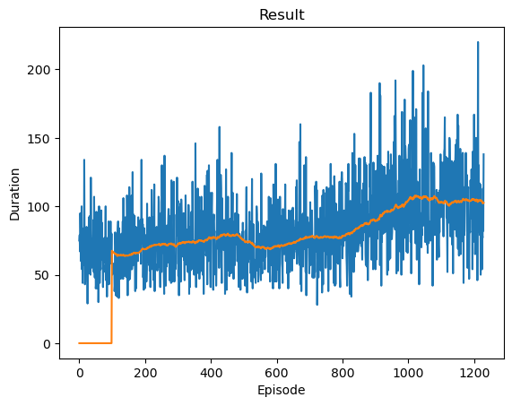
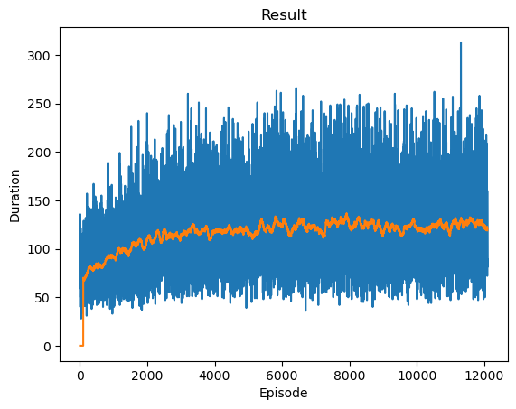
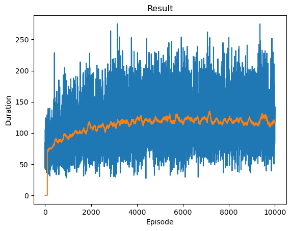
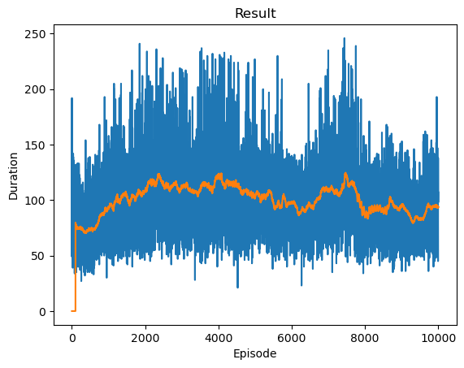
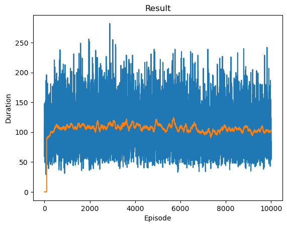
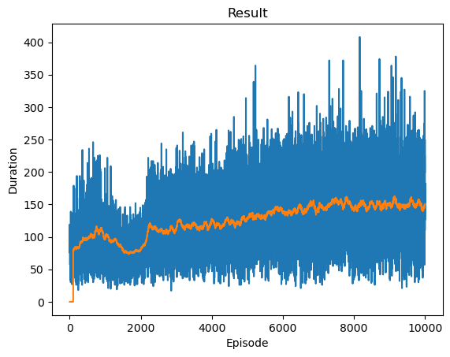
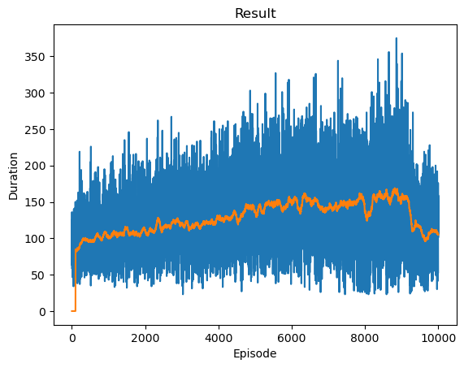
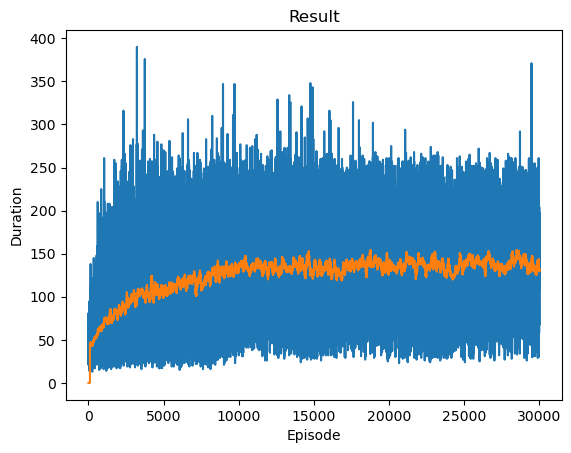
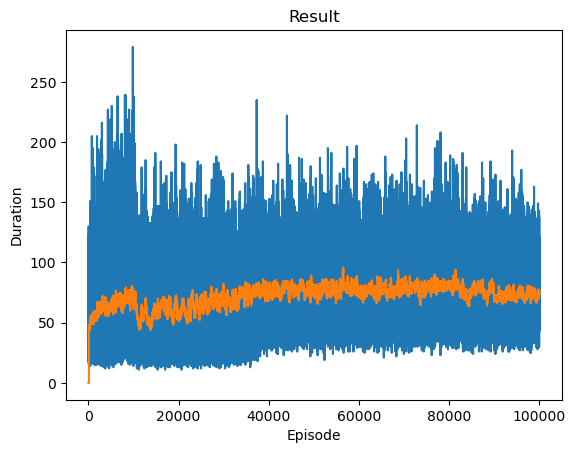

# Deep-Q
Different approaches to get Deep-Q reinforcement learning working on 2048 game.
Code based on example from a [Pytorch turtorial](https://pytorch.org/tutorials/intermediate/reinforcement_q_learning.html)

## Results
In general Deep-Q learning doesn't seem to perform poorly.
Best result is far worse than simple 1-step greedy player. 
Deeper networks did aweful somehow being worse than random.

## Future

### Try
- saving NN to disk
- run NN in non-training mode

### Ideas
- Train to a lower score (8 instead of 2048).
  - With 3 options per cell, there is 43 million states to learn with with many states being unlikely or impossible to reach
  - With just 4 options per cell (empty,2,4,8), there is 4.3 billion states to learn.
  - Don't one-hot final state (it can't be reached)
  - Try normal RL Q-learning table on smaller state space
- Use knowledge about game state update to provide update based on probability of each possible output state  
- Larger cost discount rate for future rewards
- Train using hand-coded player instead of random choice to focus exploration more on better states

## Approaches

### RL raw value
Environment1.
Report value for each cell log2 true value (4 instead of 16).
Episode 1230 avg duration 102.6



### RL binary value
Environment 2.
Report value for each cell as binary encoding of log2 true value (4 instead of 16).
Since 2048 is max value, max log2 value is 11.   Need 4 tensors for each value
```
64 -> 2**6
6 -> 0110b -> [0,1,1,0]
```

- episode 1100 avg duration 94.8499984741211
- episode 2100 avg duration 107.8499984741211
- episode 12100 avg duration 118.93000030517578



### RL one-hot value
Environment 3.
Use one-hot encoding for cell values.  Since cell can have 11 values (empty,2,4,8,16,32,64,128,256,512,1024) each cell input is a vector of 11 values.
For instance the third value (4) would have an encoding of [0,0,1,0,0,0,0,0,0,0,0]

- episode 10000 avg duration 117.19999694824219



With EPS_DECAY = 10000
- episode 10000 avg duration 119.8499984741211

")

### 4-layer network
Environment 3 w/ deeper network

IN, 128, 64, 32, OUT

- episode 3322 avg duration 75.9800033569336

**NO IMAGE**

### Different reward
Create "score" that is value squared for every each square.  Reward is change in score minus a "drag".   
The drag is expected increase in score from getting a new tile.
- Original 3-layer network
- EPS_DECAY = 10000 

Episodes
- episode 1000 avg duration 92.70999908447266
- episode 2000 avg duration 107.72000122070312    
- episode 10000 avg duration 93.86000061035156



### Flipping to Heavy-side
Flip grid after every move so heavy side (side with most non-empty elements) is at top left.
- Original 3-layer network
- EPS_DECAY = 10000 

Episodes
- episode 1000 avg duration 113.04000091552734
- episode 2000 avg duration 108.06999969482422



### Better training
Environment 6.
25% of the time start a game with a more complete initial state, instead of just 2 initial tiles.
Up to 5 tiles will be initialize with values ranging from 2 to 128. 
This allowing training examples of more later states.

- episode 8000 avg duration 140.16000366210938
- episode 10000 avg duration 150.75



### Simple Reward
Environment 7.
Give a positive reward for each step taken, and large penalty for loosing.  
That way there is motivation to keep playing, but to stay away from loosing states.

- episode 1000 avg duration 100.16999816894531
- episode 10355 avg duration 110.20999908447266



### Increasing reward
Environment 8.
Reward keeps increasing (no drag term).

- episode 1000 avg duration 121.58999633789062

** NO IMAGE **

### Better exploration
Environment 9.
Have positive reward for each cycle, with bonus for bigger values.  Force random starts, that decline over time.


- episode 1000 avg duration 66.83000183105469
- episode 2000 avg duration 83.76000213623047
- episode 3000 avg duration 99.91999816894531
- episode 5000 avg duration 101.76000213623047
- episode 7000 avg duration 120.9000015258789
- episode 10000 avg duration 134.02999877929688
- episode 20000 avg duration 131.85000610351562
- episode 30000 avg duration 130.74000549316406



### 5-layer network
Have a 5-layer network.  Even with a lot of training, the results are aweful.

IN-128-128-64-32-OUT

- episode 100000 avg duration 74.98999786376953


